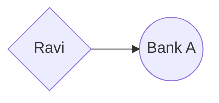
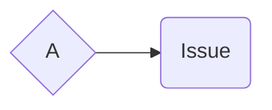
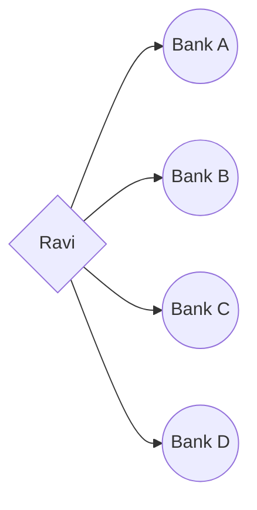

<h1 align="center"> Learnings</h1>

## vertical Scaling  vs horizontal scaling

### Availability

Let's consider a story about a person named Ravi in Assam who manages his finances using different banks in the village. Ravi starts with a bank balance of 80,000 in his account.

In the first scenario, Ravi decides to use vertical scaling by storing all his money in a single bank, which we'll call Bank A.

With vertical scaling, Ravi has 1 lakh cash available. However, when he needs to withdraw money for his daily needs, he can only rely on Bank A. This strategy seems convenient until an unexpected problem arises.

One day, the servers of Bank A encounter issues, causing disruption in their services. 

Now, even though Ravi has sufficient funds in his account, he cannot withdraw any money from Bank A due to the server problem. This limitation of vertical scaling becomes evident—despite having the necessary resources, Ravi is unable to access his money when the bank's servers are down.

On the other hand, Ravi realizes the drawbacks of vertical scaling and decides to adopt horizontal scaling. In this approach, he distributes his cash across multiple banks in the village, such as Bank A, Bank B, Bank C, and Bank D. This gives him the flexibility to access his funds from any operational bank whenever needed.

With horizontal scaling, Ravi's cash is spread across different banks, mitigating the risk of relying on a single bank. In case one bank encounters issues, Ravi can still access his money from the other banks. This distribution provides redundancy and ensures that Ravi's needs are met even if there is a problem with a specific bank.

To summarize, vertical scaling involves concentrating resources (money in Ravi's case) in a single entity (Bank A), which can lead to a lack of accessibility in the event of server issues. In contrast, horizontal scaling distributes resources across multiple entities (different banks), allowing for greater flexibility and resilience.

### throughtput

Vertical Scaling:

* Ravi keeps all his money in a single bank (Bank A).
* The throughput of cash transactions is limited to the capacity and efficiency of Bank A's systems.
* If there are issues with Bank A's servers or a slowdown in their processing capabilities, it can impact the throughput of cash transactions.
* Ravi may face difficulties in accessing his money and carrying out transactions, regardless of the amount of funds he has.
Horizontal Scaling:

* Ravi distributes his money across multiple banks (Bank A, Bank B, Bank C, and Bank D).
* This allows Ravi to choose any operational bank at a given time, increasing the potential throughput of cash transactions.
* The workload is distributed among different banks, reducing the risk of bottlenecks caused by server issues or high transaction volumes in a single bank.
* Ravi can access his funds from any operational bank, ensuring a more efficient utilization of resources and potentially higher throughput.